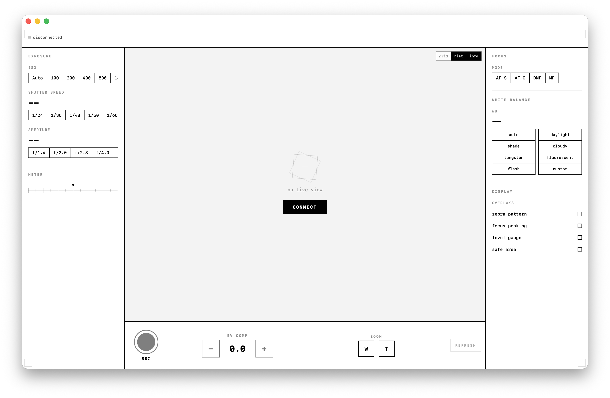
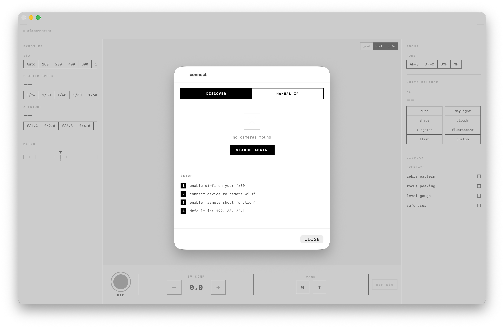

# sony-fx30-controller

native macOS & iOS app to remotely control the Sony FX30 cinema camera over Wi-Fi using the PTP/IP protocol. no Sony SDK required — pure Swift implementation reverse-engineered from the protocol.





## features

- **live view** — real-time MJPEG viewfinder with pinch-to-zoom
- **full camera control** — ISO, shutter speed, aperture, exposure compensation, white balance, focus mode
- **record** — start/stop recording with live timecode
- **zoom** — continuous zoom in/out (W/T) with press-and-hold
- **SSDP discovery** — auto-detect cameras on the network
- **histogram** — real-time luminance histogram overlay
- **grid overlay** — rule of thirds with center cross
- **info overlay** — live exposure parameters on the viewfinder
- **exposure meter** — visual EV compensation gauge
- **cross-platform** — runs on macOS 14+ and iOS 17+ from a single codebase

## design

pure black & white. sharp corners. 1px borders. monospace typography. geometric primitives. no shadows, no gradients, no color. 150ms linear animations. inspired by the [screenpipe](https://screenpi.pe) brand system.

## protocol

communicates directly with the camera via **PTP/IP** (Picture Transfer Protocol over IP) on port `15740`. the implementation handles:

- dual TCP socket architecture (command + event channels)
- full PTP/IP handshake (INIT_CMD_REQ → INIT_CMD_ACK → INIT_EVENT_REQ → INIT_EVENT_ACK)
- Sony SDIO extension setup for proprietary property access
- property get/set for all Sony-specific device properties
- live view streaming via `GetObject(0xFFFFC002)` returning JPEG frames
- keepalive heartbeat (15s interval)
- event listener for camera-initiated state changes

### sony property codes

| property | code | description |
|---|---|---|
| ISO | `0xD21E` | ISO sensitivity |
| shutter speed | `0xD20D` | shutter speed value |
| aperture | `0x5007` | f-number |
| white balance | `0x5005` | white balance mode |
| focus mode | `0x500A` | AF-S, AF-C, DMF, MF |
| exposure bias | `0x5010` | EV compensation |
| recording | `0xD2C8` | start/stop movie recording |
| battery | `0xD218` | battery level percentage |
| zoom | `0xD2DD` | zoom direction and speed |
| storage | `0xD222` | remaining storage |

## setup

1. enable Wi-Fi on your FX30
2. connect your Mac/iPhone to the camera's Wi-Fi network
3. enable "Remote Shoot Function" on the camera (Menu → Network → Remote Shoot)
4. camera IP is typically `192.168.122.1`

## build

```bash
# macOS
swift build
.build/debug/SonyFX30Controller

# iOS — open in Xcode
open Package.swift
# select your iPhone as the run destination
```

## requirements

- macOS 14+ or iOS 17+
- Xcode 15+ (for iOS builds)
- Sony FX30 with Wi-Fi enabled

## compatibility

built for the Sony FX30 but should work with other Sony cameras that support PTP/IP remote control, including:

- FX3, FX6, FX9
- A7 series (A7IV, A7SIII, A7RV)
- A9 series
- ZV-E1, ZV-E10

## architecture

```
Sources/SonyFX30Controller/
├── Camera/
│   ├── PTPProtocol.swift      — PTP/IP constants, packet types, Sony property codes
│   ├── PTPIPClient.swift      — actor-based TCP client using Network.framework
│   ├── SSDPDiscovery.swift    — multicast camera discovery
│   ├── CameraManager.swift    — ObservableObject bridging protocol to UI
│   └── PlatformImage.swift    — cross-platform NSImage/UIImage abstraction
├── Theme/
│   └── AppTheme.swift         — B&W design system, shared components
├── Views/
│   ├── LiveViewPanel.swift    — viewfinder, histogram, grid, info overlays
│   ├── ControlPanel.swift     — record, EV, zoom controls
│   ├── StatusBar.swift        — connection, recording, battery, FPS
│   ├── SettingsPanelLeft.swift — ISO, shutter, aperture, exposure meter
│   ├── SettingsPanelRight.swift — focus, white balance, display overlays
│   └── ConnectionView.swift   — discovery + manual IP connection
├── ContentView.swift          — adaptive layout (wide/compact)
└── SonyFX30App.swift          — app entry point
```

## license

MIT

---

built with [claude code](https://claude.ai/code)
